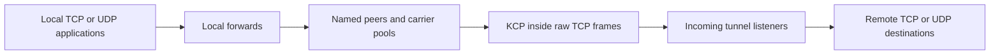
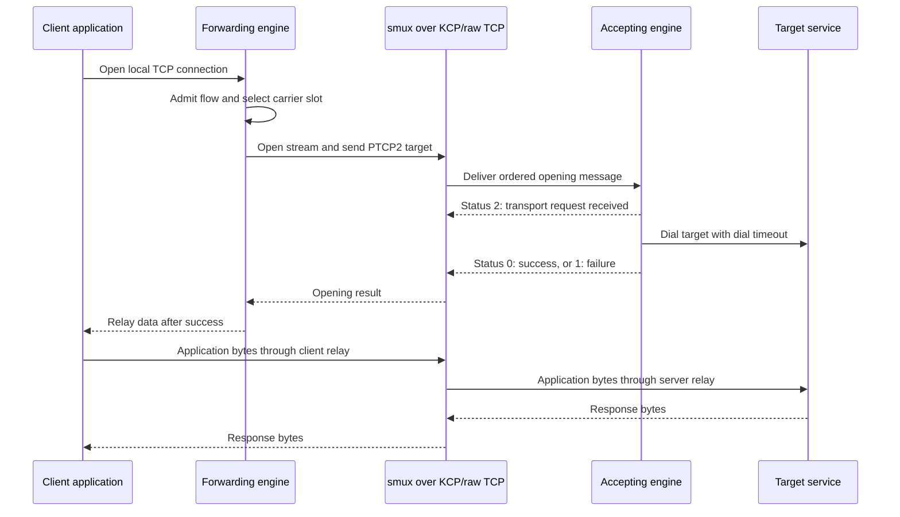
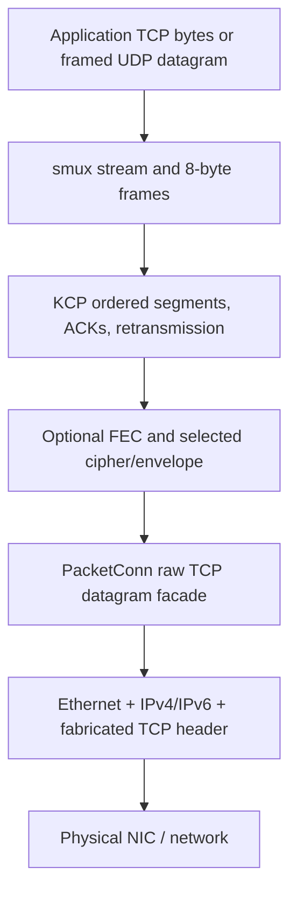

# Application architecture and source map

This describes the committed enterprise source and the final deployed release.
It includes scoped live reconciliation, shared fixed-source KCP lanes and an
indexed outstanding-ACK path. Unqualified outer-sequence experiments are
archived separately. [STATUS.md](STATUS.md) and the
[final deployment report](FINAL-DEPLOYMENT-REPORT.md) identify measurements and
remaining qualification limits.

## Process model

There is one executable and one engine per running instance. A configuration
can have incoming tunnel listeners, named outgoing peers and local forwards
together. “Client” and “server” describe configured responsibilities, not
separate executables or old `role` modes. A listener accepts multiple clients
on its tunnel port; many application connections share relatively few carriers.

Both halves of this diagram can exist in one instance. A forward selects a
peer by name and sends its target address; the accepting server resolves/dials
that target. Listeners are not hardwired to a single target service. Current
configuration lacks per-client identities and destination ACLs.

## Repository layout

| Path | Responsibility |
|---|---|
| `cmd/main.go` | Cobra entry point and subcommand registration. |
| `cmd/run/` | Check compatibility command and file-watching runtime lifecycle. |
| `cmd/config/` | Dedicated `config validate` CLI with human/JSON results. |
| `cmd/ping/`, `cmd/dump/` | Peer control probe and raw payload capture utilities. |
| `cmd/firewall/`, `cmd/secret/`, `cmd/version/` | Journal recovery, key generation and build information. |
| `cmd/bench/` | Test target/load/verification tool; separate benchmark executable. |
| `internal/engine/` | Application runtime, peers/flows, discovery, limits, adaptation, firewall and diagnostics. |
| `internal/conf/` | Lower-level network/KCP preparation, defaults, cipher construction and validation. |
| `internal/protocol/` | Inner stream opening/control message encoding and decoding. |
| `internal/tnet/` | Connection/listener/stream abstractions and target host/port representation. |
| `internal/tnet/kcp/` | Adapter binding raw packet connections, KCP sessions and smux streams. |
| `internal/socket/` | Ethernet/IP/TCP encoding/capture/injection and Linux batch I/O. |
| `internal/pkg/iterator/` | Small flag-cycle iterator helper. |
| `third_party/kcp-go/` | Local reliable-datagram fork, its own module/tests/license/patch log. |
| `third_party/smux/` | Local stream multiplexing fork, its own module/tests/license/patch log. |
| `example/` | Generic commented YAML examples. |
| `deploy/` | Generic systemd unit for /usr/local and /etc installation. |
| `scripts/` | Namespace link emulation, stress/qualification, evidence export and service tests. |
| `docs/` | Architecture, configuration, history, evidence and operations. |
| `docs/deployed/` | Recorded deployment YAML/unit snapshots, separate from generic defaults. |
| `build/` | Ignored executables, profiles, captures, local worktrees and experimental artifacts. |
| `.github/workflows/` | Repository test/build automation. |

The root module imports the KCP and smux forks through local `replace`
directives in `go.mod`. Each fork is a separate Go module: root `go test ./...`
does not replace running the fork suites. An upstream dependency update needs
its patch history and transport/workload regressions reviewed.

## Engine files and responsibilities

| File in `internal/engine` | Role |
|---|---|
| [config.go](../internal/engine/config.go) | Public unified YAML schema, endpoint/default preparation and validation. |
| [discover.go](../internal/engine/discover.go) | Startup route/source/interface/next-hop discovery and overrides. |
| [engine.go](../internal/engine/engine.go) | Startup/shutdown, resource registration, port guards, admission, TCP accept and server control dispatch. |
| [reload.go](../internal/engine/reload.go) | Immutable route publication, dormant resource staging, scoped replacement/rollback and live reliability updates. |
| [watch.go](../internal/engine/watch.go) | Bounded content reader, debounce, SIGHUP and failed-candidate retry. |
| [peer.go](../internal/engine/peer.go) | Carrier slots, lazy connection, selection/growth, opening, retries and invalidation. |
| [relay.go](../internal/engine/relay.go) | Bidirectional TCP-to-stream relay, readiness-driven scratch buffers, counters and half-close. |
| [udp.go](../internal/engine/udp.go) | Local UDP source-flow map, bounded queues, datagram framing/relay and expiry. |
| [adaptive.go](../internal/engine/adaptive.go) | Per-carrier delivery/queue estimation, pacing/windows and ACK/reorder/RTO-floor adjustments. |
| [firewall.go](../internal/engine/firewall.go) | Scoped rule creation/rollback and instance ownership. |
| [firewall_journal.go](../internal/engine/firewall_journal.go) | Persistent intent, dead-owner recovery and owned-chain cleanup. |
| [logging.go](../internal/engine/logging.go) | Bounded asynchronous slog output, level/format/sampling configuration. |
| [observe.go](../internal/engine/observe.go) | Runtime/transport snapshots and debug summaries. |
| [metrics.go](../internal/engine/metrics.go) | Prometheus-style process/flow/carrier counters. |
| [ping.go](../internal/engine/ping.go) | Temporary peer probe using the engine's configuration/ownership conventions. |

## Objects and ownership

| Object | Owns / retains | Lifetime |
|---|---|---|
| `Engine` | Atomic runtime view, resource transaction lock, owned resource registry, controller registry, diagnostics and tracked goroutines | Process run |
| `runtimeView` | Immutable effective config, named pools and bind-to-target/pool routing snapshot | One config publication |
| `liveResource` | One peer pool or listening bind, endpoint template, staged activation and its rule journal | Until removal/replacement |
| `peer` | Resource-owned immutable/live endpoint template, bounded carrier slots, allocation/growth locks and its own firewall journal | Peer generation |
| `slot` | Reserved source network/guard references, cached outgoing connection, score and reconnect backoff | Peer pool member; carrier can be replaced |
| `kcp.Listener` adapter | Raw socket(s), underlying KCP listener(s), fanout child workers and accept aggregation | Incoming endpoint |
| Outgoing `kcp.Conn` adapter | Owned PacketConn, UDPSession and smux Session | One outgoing carrier |
| Accepted `kcp.Conn` adapter | Its UDPSession and smux Session; **no owned PacketConn** | One accepted carrier |
| smux stream / `kcp.Strm` | Logical stream ID, receive slices, credits, deadlines and directional close state | Application/control stream |
| `udpFlow` | Source-address mapping, eight-entry datagram queue, cancellation and activity time | Local UDP conversation until idle/closed |
| `PacketConn` | Selected driver and address/deadline/flag-state facade | Listener worker or outgoing carrier |

Accepted carriers share the listener's packet socket. Closing one accepted
carrier must not close that socket and disconnect other clients. This also
explains why per-carrier owning PacketConn can be nil: listener TX-drop metrics
are socket-scoped. The deployed fix samples those listener sockets safely,
rather than dereferencing an absent owning socket in accepted-carrier logs.

Outer flag state is indexed by remote address/port and guarded by conversation
ownership. Late teardown from an old carrier cannot remove a replacement
carrier's flag state. The fanout group shares the baseline encoder/flag state
across its workers; packet worker membership is fixed before accepting traffic.

## Startup and shutdown

Startup prepares configuration and discovery, starts diagnostics, recovers
owned dead-process journals, and constructs an engine. The first resource
transaction stages source reservations, rules, raw listeners, local forward
binds and optional metrics. It publishes the complete route view before
activating accept loops. Outgoing carriers remain lazy; reservations do not
prove peer delivery. Controllers, diagnostics and the file watcher then run.

Every peer/listener owns its own rule journal, so removing a route cannot delete
another endpoint's bypass rules. A failed initial transaction closes provisional
resources. Shutdown cancels the engine, serializes with reload, closes every
current/retained resource and journal, joins tracked tasks and drains diagnostics.
SIGKILL cannot run cleanup; ExecStopPost or later dead-owner recovery handles
its journals. Application streams do not survive process replacement.

## Configuration generations

File polling hashes bounded snapshots and waits for stable candidate bytes.
Strict parsing/preparation uses those exact bytes. The reload transaction
reuses unchanged resources, stages new binds/pools dormant, and applies safe
KCP reliability setters under the tuner lock. That same lock registers new
carriers against their latest endpoint template, avoiding stale settings if
accept/dial overlaps a reload. Listener templates and peer templates are
published atomically for future carriers.

One atomic `runtimeView` publication pairs each forward with its target and
peer. TCP accepts and new UDP sources capture that pair. Existing TCP streams
and UDP sources keep their captured target. Peer/listener generation contexts
cancel opening work on retirement. A half-closed TCP relay waits on its existing
copy-result, stream-full-close and generation-cancellation channels; full closure
releases an idle opposite leg without adding per-flow timers or goroutines. Removing a TCP forward closes its
accept socket while established streams remain; removing a UDP bind closes
its source flows. A transport replacement closes only the affected endpoint's
carriers. Occupied fixed binds require break-before-make; failure reconstructs
old affected resources. Failed restoration is reported as degraded health.

See [LIVE-RELOAD.md](LIVE-RELOAD.md) for field-level impact and retry semantics.

## TCP opening and data path

On a new carrier, a separate PTCPF control stream requests the peer's outer TCP
flag cycle. The engine associates it with that carrier generation. Each local
TCP connection then gets its own smux stream. Opening success is distinct from
transport receipt, so a slow/unreachable destination should not automatically
be mistaken for a failed transport. Per-opening deadlines, failed-slot exclusion
and reconnect backoff bound new work. An unacknowledged opening reserves time
for each remaining carrier: its first-receipt budget is the smaller of
`max(2s, 8 × RTT)` and remaining deadline divided by untried carriers. The last
carrier gets the remaining deadline. Receipt status 2 restores the full target
dial budget. Retrying a new stream closes that stream while retaining its busy
carrier and established forwards. Replacing a carrier loses its existing
streams; retrying a new opening is not transparent replay of an established TCP
application session.

In the deployed ownership release, the reserved receipt deadline also covers
SYN queue/submission via `OpenStreamContext`; it does not set a shared KCP
connection deadline. Failed new streams release local ownership immediately and
queue a best-effort reset without waiting for ordinary close. Successful carrier
setup retains normal PTCPF close semantics. Established stream close is unchanged.

After opening, a relay copies in both directions. The TCP-to-stream side waits
for netpoll readiness, peeks queued bytes, then acquires a size-class buffer and
returns it after the write. The ownership release snapshots asynchronously
queued payloads into pooled size classes, so an opening/write timeout cannot
return scratch storage that the carrier still references. Caller and sender
each release a reference before queued storage is recycled. Expired frames
that have not been dispatched are dropped and their byte credit refunded;
in-flight writes retain credit because their bytes can still be accepted.
The stream-to-TCP side uses smux's WriterTo path to
consume queued slices. Neither path reserves a copy buffer for every idle TCP
connection. Directional EOF closes the corresponding write direction while
allowing the other direction to finish; full abort/reset is separate. The dirty
workspace's extra half-close deadline is not part of the deployed architecture.

## UDP flow path

One local UDP socket exists per UDP forward. Its source IP/port map selects a
logical flow; each flow opens PUDP2 over one smux stream. A two-byte big-endian
length precedes every datagram, allowing zero-length messages and preserving
boundaries up to 65,507 bytes. The server dials a UDP destination and converts
stream records to/from destination datagrams. Replies return to the original
local source address/port.

A local flow has a bounded eight-datagram queue and idle expiry. A full queue
can discard datagrams; KCP reliability does not recover data never admitted to
that queue. Once admitted, datagrams share reliable ordered delivery and can
experience head-of-line delay. UDP is not an alternate outer transport or a
SOCKS UDP-associate implementation.

## Encapsulation, encoding and capture

Receive processing reverses the layers. KCP uses a `net.PacketConn` facade and
UDPAddr-shaped endpoint metadata because that is its library interface; it does
not imply UDP transport on the wire. Capture filters select the local tunnel
address/port before kernel TCP handling. Owned rules keep conntrack/RST/kernel
TCP input from interfering. Local TCP listeners reserve the ports only.

The baseline's fabricated outer sequence/ACK/timestamps do not provide data
reliability. KCP's own conversation/sequence/ACK state does. Packet headers and
payload boundaries are described in [TRANSPORT.md](TRANSPORT.md), including
why normal TCP replacement and unqualified sequence experiments would change
the mechanism.

Two existing drivers implement this facade:

- **AF_PACKET:** Linux nonblocking packet socket, BPF, fixed receive/encode
  storage and sendmmsg/recvmmsg batches. Hash fanout distributes incoming
  carriers; it does not divide every stream of one carrier across workers.
- **Pcap:** libpcap receive and injection handles, pooled encoders/decoders and
  serialized injection. It uses one worker. Recognized Linux transmit ENOBUFS
  is counted as dropped datagrams for KCP recovery. Permanent errors remain
  failures in both paths. AF_PACKET separately retries wholly rejected ENOBUFS
  batches at most three times; partial sends are never replayed.

## Concurrency, buffering and backpressure

Go goroutines/netpoll service TCP accept, relays, UDP flow work, KCP/mux I/O and
engine loops. This is not an OS thread per customer. Effective GOMAXPROCS and
kernel scheduling determine CPU use. Each application stream still carries
socket/stream/goroutine bookkeeping; “no idle scratch buffer” does not mean
zero per-connection memory.

KCP queues/retransmits datagrams and shares a timed scheduler. Its postprocessing
FIFO handles optional FEC/crypto and bounded packet output. Smux provides
per-stream credits, an aggregate receive budget and bounded-priority controls.
Its receive rings grow on demand. Fixed-size control headers are parsed even
when the aggregate data budget is full; PSH payload admission still waits for
tokens. An admitted data frame can overshoot the budget by one frame, as before.
Outgoing streams enter the receive map before SYN submission so a full-duplex
peer's immediate reply cannot be discarded; failed submissions reclaim that
registration and any early data without another blocking control write.
Async coalesced credits keep readers from
waiting directly on opposite-direction writes; optional WINS hints expedite
feedback while reliable UPD remains authoritative.

Slow targets/readers push back through TCP, mux credits and carrier windows.
Queues, windows, admission and Go/cgroup/kernel memory limits are distinct.
Multiple streams on one KCP carrier still share ordered-delivery stalls; pools
can isolate new work across carriers, but cannot move already-established
streams to another carrier without ending them.

## Adaptation and observability

An engine controller belongs to a carrier, not every customer stream. New bulk
carriers learn at an RTT-based 50–250 ms cadence; idle, static and established
controllers update every 250 ms. One shared 50 ms ticker dispatches those
updates. Coherent transport counters drive send window/pacing, ACK delay,
reorder allowance and RTO floor within limits. Tiny acknowledged/pending
messages use packet-window control without historical bulk byte pacing, so
control traffic does not erase a prior bulk capacity estimate. A new full-size
backlog resumes bulk pacing before its first ACK. Classification uses sizes,
not customer payload parsing. Mux receive-window
adaptation follows drain rate and RTT. Packet worker count, source interface/
address/MAC and path MTU are not continuously auto-tuned. The earlier physical recovery
profile disabled the enterprise controller. The final four-carrier profile
enables transport adaptation while retaining fixed receive-buffer ceilings and
a fixed carrier count. KCP's ordinary RTT-based retries remain in both modes.

Info summaries, sampled debug lifecycle/transport events and a bounded async
log queue expose state without blocking forwarding on log output. Optional
loopback HTTP serves metrics/health and pprof. Health is process liveness, not
delivery or authentication. Listener observation is snapshotted under the tuner
mutex so startup registration does not race the logger. Mux capacity/occupancy/
payload blockage, raw queue drops/retries and small-message classification are
observable without per-packet log spam. The independent finite production
observer is described in [DIAGNOSTICS.md](DIAGNOSTICS.md).

## Testing structure and limits

Unit/race tests sit beside engine, protocol, socket and fork code. The simulated
KCP clock tests loss/reorder/timing deterministically. Namespace harnesses run
real processes and sockets through netem bandwidth/delay/loss/reorder schedules,
integrity checks, HTTP/iperf workloads, scale soaks and service recovery. Real
Reality probes established the current deployment profile separately.

There is currently no distributed control plane,
per-customer authentication/ACL layer, migration across backend restarts, universal
path-MTU discovery, automatic FEC selection, or proven thousands-busy-customer
capacity on the current hosts. See [CONFIGURATION.md](CONFIGURATION.md),
[OPERATIONS.md](OPERATIONS.md)
and the versioned evidence before choosing structural changes.

## Shared source lanes and ACK indexing

`Endpoint.SharedSource` prepares the internal KCP routing contract on both ends.
`internal/tnet/kcp/shared.go` owns one physical packet socket, encoder and source
reservation per outgoing pool. Every lane has its own KCP/mux state and timers;
closing a lane keeps the socket/siblings, while pool retirement closes all.
`third_party/kcp-go/conversation_socket.go` routes by remote address and inner
conversation ID. Outgoing shared groups reject unsolicited conversations.
Parity-only FEC lacks a conversation ID, so shared mode rejects it. Ordinary
address/reset/FEC routing remains the default.

Server flag ownership retains all live lanes for a tuple; last-lane cleanup
removes the override. Shared physical socket counters can appear under multiple
lane labels and must not be summed as independent per-lane drops.

`third_party/kcp-go/fastack_index.go` maintains ordered links by sequence number
inside the send ring. ACKs unlink in constant time; gap processing visits only
outstanding segments. Numeric links survive ring reallocation and SN wrap.
There are no per-ACK allocations; retained entries add eight bytes. The linear
algorithm is the differential-test oracle. Retransmission evidence and wire
encoding remain unchanged.

`small_write_flush` is a lock-protected scheduling exception for bounded logical
writes under bulk batching. It preserves FIFO byte order and the ACK policy;
zero preserves preset behavior. Reliability reload updates it in place. Static
endpoints still sample slot pressure for configured pool selection/growth.

## Verified source-tuple recovery

[path_recovery.go](../internal/engine/path_recovery.go) retains compatibility
with shared-source peer recovery. [carrier_recovery.go](../internal/engine/carrier_recovery.go)
extends it to independently reserved client source tuples. A one-second sampler
records each slot's opening failures and outbound ACK progress, including a
separate established-data stall clock. Inbound traffic cannot conceal an
outbound half-path failure; remote zero windows are treated as backpressure.

Each candidate is an unpublished one-slot resource with its own guard, socket
and journal. PPONG proves a protocol round trip outside the reload lock. Commit
rechecks resource/config/slot identity and old-slot progress, transfers the
verified slot/journal into the lasting pool, and retargets its adaptive/live
reliability registration. Only the old slot closes: sibling slots, peer lifecycle
context and route/listener identities stay intact. Retired slots reject late
opens so a pre-publication reader cannot resurrect a released tuple. A failed
old-rule cleanup retains the guard until cleanup succeeds.

The configured resource specification stays unchanged; effective slot ports
survive identical reloads. One probe per slot and four process-wide bound
candidate resources. Failed/stale candidates are closed without touching live
streams. Old failed streams reconnect rather than migrate; each application
stream remains pinned to one ordered KCP/mux session. The feature is opt-in.

## Live source-port migration

`path_recovery.preserve_connections` adds a negotiated physical move to the
independent-source recovery transaction. Each opted-in client slot owns a
one-source `SharedDialer`; it normally holds one logical KCP/mux carrier and
briefly holds the existing carrier plus the candidate control carrier after a
move. Closing a logical conversation never closes that slot-owned socket.

[internal/engine/migration.go](../internal/engine/migration.go) owns the bounded
capability registry and token/check/move/reply inner controls. A check proves
backend support without mutating routing. Candidate PPONG, capability checks
and ordinary generation/config rechecks precede the local socket transfer.
An idempotent commit moves the backend session to the candidate's actual receive
worker and new return address. Higher epochs supersede ambiguous older commits;
delayed lower epochs cannot revert the tuple. Lost replies are retried without
closing the preserved mux or redialing its application targets.

[third_party/kcp-go/migration.go](../third_party/kcp-go/migration.go) transfers
conversation-map ownership under a control-plane mutex and existing listener
locks. An immutable atomic route snapshot supplies current addresses and socket
ownership. A read lock per output batch excludes an in-flight batch submission
from a move; queued output is retargeted when transmitted. Old socket retirement
cannot close the session after its map entry has transferred. Old in-flight
packets can be discarded; the original KCP sequence/reorder/ARQ state handles
retransmission and duplicate suppression. Pending ARQ is woken after backend
confirmation; the backend also wakes it when committing the move. Normal ARQ
continues while confirmation is pending.
There is no additional global per-packet routing lookup, no per-TCP migration
state and no additional application-byte copy for migration.

Each outgoing listener publishes an atomic one-conversation receive hint. Input
uses it only when conversation ID, remote tuple and current route ownership all
match; otherwise the authoritative listener map handles the packet. This avoids
address formatting and map locking on ordinary client input without letting a
stale hint deliver retired-tuple packets after migration. The hint is cleared
when its conversation moves or closes. Immediate ACK batching follows the current
listener owner, including after a move between capture workers.

The outgoing `Conn` retains the same KCP and smux pointers. Its atomic effective
packet reference keeps telemetry correct. Its adaptive controller is retargeted
to the new slot without discarding learned RTT/window/pacing state. Firewall
journals and reservations transfer with the adopted slot as in ordinary recovery.
The backend encoder's seed/counter remain shared and live; the new client source
uses normal fresh-encoder initialization. Both fixed S/PA and the existing
TCP option/sequence/ACK/timestamp code remain unchanged.

One minute of post-move health observation emits at most one early-stall warning.
Normal idle queues, brief gaps and remote zero-window backpressure do not qualify
as transport stalls. This is correlation evidence, not proof of filtering.
