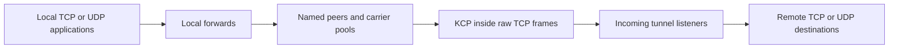
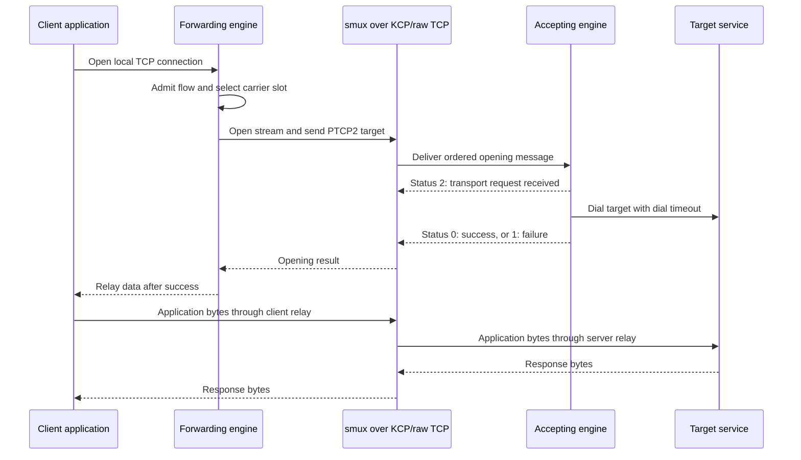
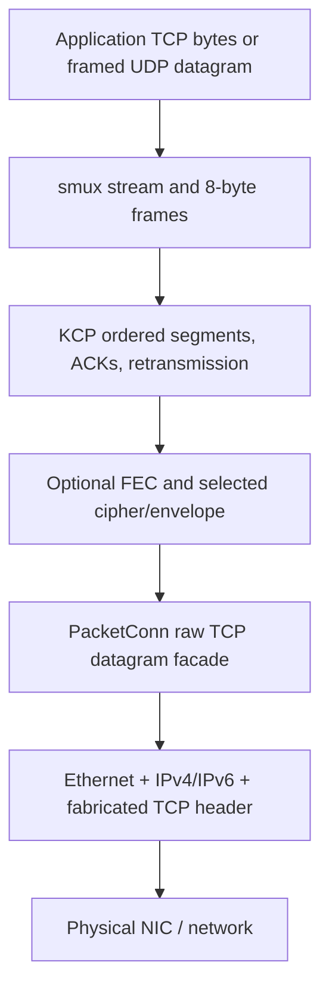

# Application architecture and source map

This describes the committed enterprise design at `20227d3`, with explicit
notes for the deployed `1c77c55` base. The broad architecture is shared; the
newer transmit-pressure/firewall/diagnostic fixes are not deployed. The dirty
workspace's timeout/sequence edits and the separate `4c7aa6a` experiment are
excluded. [STATUS.md](STATUS.md) identifies versions and qualification boundaries.

## Process model

There is one executable and one engine per running instance. A configuration
can have incoming tunnel listeners, named outgoing peers and local forwards
together. “Client” and “server” describe configured responsibilities, not
separate executables or old `role` modes. A listener accepts multiple clients
on its tunnel port; many application connections share relatively few carriers.

Both halves of this diagram can exist in one instance. A forward selects a
peer by name and sends its target address; the accepting server resolves/dials
that target. Listeners are not hardwired to a single target service. Current
configuration lacks per-client identities and destination ACLs.

## Repository layout

| Path | Responsibility |
|---|---|
| `cmd/main.go` | Cobra entry point and subcommand registration. |
| `cmd/run/` | Strict configuration load/check, signal context and engine startup. |
| `cmd/ping/`, `cmd/dump/` | Peer control probe and raw payload capture utilities. |
| `cmd/firewall/`, `cmd/secret/`, `cmd/version/` | Journal recovery, key generation and build information. |
| `cmd/bench/` | Test target/load/verification tool; separate benchmark executable. |
| `internal/engine/` | Application runtime, peers/flows, discovery, limits, adaptation, firewall and diagnostics. |
| `internal/conf/` | Lower-level network/KCP preparation, defaults, cipher construction and validation. |
| `internal/protocol/` | Inner stream opening/control message encoding and decoding. |
| `internal/tnet/` | Connection/listener/stream abstractions and target host/port representation. |
| `internal/tnet/kcp/` | Adapter binding raw packet connections, KCP sessions and smux streams. |
| `internal/socket/` | Ethernet/IP/TCP encoding/capture/injection and Linux batch I/O. |
| `internal/pkg/iterator/` | Small flag-cycle iterator helper. |
| `third_party/kcp-go/` | Local reliable-datagram fork, its own module/tests/license/patch log. |
| `third_party/smux/` | Local stream multiplexing fork, its own module/tests/license/patch log. |
| `example/` | Generic commented YAML examples. |
| `deploy/` | Generic systemd unit for /usr/local and /etc installation. |
| `scripts/` | Namespace link emulation, stress/qualification, evidence export and service tests. |
| `docs/` | Architecture, configuration, history, evidence and operations. |
| `docs/deployed/` | Recorded actual recovery YAML/unit snapshots, separate from generic defaults. |
| `build/` | Ignored executables, profiles, captures, local worktrees and experimental artifacts. |
| `.github/workflows/` | Repository test/build automation. |

The root module imports the KCP and smux forks through local `replace`
directives in `go.mod`. Each fork is a separate Go module: root `go test ./...`
does not replace running the fork suites. An upstream dependency update needs
its patch history and transport/workload regressions reviewed.

## Engine files and responsibilities

| File in `internal/engine` | Role |
|---|---|
| [config.go](../internal/engine/config.go) | Public unified YAML schema, endpoint/default preparation and validation. |
| [discover.go](../internal/engine/discover.go) | Startup route/source/interface/next-hop discovery and overrides. |
| [engine.go](../internal/engine/engine.go) | Startup/shutdown, resource registration, port guards, admission, TCP accept and server control dispatch. |
| [peer.go](../internal/engine/peer.go) | Carrier slots, lazy connection, selection/growth, opening, retries and invalidation. |
| [relay.go](../internal/engine/relay.go) | Bidirectional TCP-to-stream relay, readiness-driven scratch buffers, counters and half-close. |
| [udp.go](../internal/engine/udp.go) | Local UDP source-flow map, bounded queues, datagram framing/relay and expiry. |
| [adaptive.go](../internal/engine/adaptive.go) | Per-carrier delivery/queue estimation, pacing/windows and ACK/reorder/RTO-floor adjustments. |
| [firewall.go](../internal/engine/firewall.go) | Scoped rule creation/rollback and instance ownership. |
| [firewall_journal.go](../internal/engine/firewall_journal.go) | Persistent intent, dead-owner recovery and owned-chain cleanup. |
| [logging.go](../internal/engine/logging.go) | Bounded asynchronous slog output, level/format/sampling configuration. |
| [observe.go](../internal/engine/observe.go) | Runtime/transport snapshots and debug summaries. |
| [metrics.go](../internal/engine/metrics.go) | Prometheus-style process/flow/carrier counters. |
| [ping.go](../internal/engine/ping.go) | Temporary peer probe using the engine's configuration/ownership conventions. |

## Objects and ownership

| Object | Owns / retains | Lifetime |
|---|---|---|
| `Engine` | Config/context, named peers, top-level closers, firewall journal, controller registry, diagnostics and tracked goroutines | Process run |
| `peer` | Endpoint and bounded carrier-slot pool; selection/growth locks | Engine run |
| `slot` | Reserved source network/guard references, cached outgoing connection, score and reconnect backoff | Peer pool member; carrier can be replaced |
| `kcp.Listener` adapter | Raw socket(s), underlying KCP listener(s), fanout child workers and accept aggregation | Incoming endpoint |
| Outgoing `kcp.Conn` adapter | Owned PacketConn, UDPSession and smux Session | One outgoing carrier |
| Accepted `kcp.Conn` adapter | Its UDPSession and smux Session; **no owned PacketConn** | One accepted carrier |
| smux stream / `kcp.Strm` | Logical stream ID, receive slices, credits, deadlines and directional close state | Application/control stream |
| `udpFlow` | Source-address mapping, eight-entry datagram queue, cancellation and activity time | Local UDP conversation until idle/closed |
| `PacketConn` | Selected driver and address/deadline/flag-state facade | Listener worker or outgoing carrier |

Accepted carriers share the listener's packet socket. Closing one accepted
carrier must not close that socket and disconnect other clients. This also
explains why per-carrier owning PacketConn can be nil: listener TX-drop metrics
are socket-scoped. The undeployed fix samples those listener sockets safely,
rather than dereferencing an absent owning socket in accepted-carrier logs.

Outer flag state is indexed by remote address/port and guarded by conversation
ownership. Late teardown from an old carrier cannot remove a replacement
carrier's flag state. The fanout group shares the baseline encoder/flag state
across its workers; packet worker membership is fixed before accepting traffic.

## Startup and shutdown

Startup proceeds through configuration/defaults and route discovery, diagnostics,
dead-owner firewall recovery, engine context/controllers, optional Go soft
memory limit, FD limit adjustment, incoming endpoint reservation/rules/sockets,
outgoing slot reservation/rules, local forward binds, and optional metrics HTTP.
Outgoing carrier creation is lazy when traffic needs a slot; reserving slots
at startup does not prove peer delivery. Discovery may emit a short neighbor
probe; the data plane remains raw TCP/KCP.

The engine registers resources and startup intent so a partial failure can close
already-created sockets/guards and roll back its own firewall work. Its context
and wait group coordinate shutdown: cancel work, close peers and top-level
resources, wait for engine tasks, remove owned firewall rules, log the result,
and drain diagnostics. SIGKILL cannot execute that path; systemd ExecStopPost
or later recovery handles dead-owner journals. Application TCP streams do not
survive a process restart.

## TCP opening and data path

On a new carrier, a separate PTCPF control stream requests the peer's outer TCP
flag cycle. The engine associates it with that carrier generation. Each local
TCP connection then gets its own smux stream. Opening success is distinct from
transport receipt, so a slow/unreachable destination should not automatically
be mistaken for a failed transport. Per-opening deadlines, failed-slot exclusion
and reconnect backoff bound new work. Replacing a carrier loses its existing
streams; retrying a new opening is not transparent replay of an established TCP
application session.

After opening, a relay copies in both directions. The TCP-to-stream side waits
for netpoll readiness, peeks queued bytes, then acquires a size-class buffer and
returns it after the write. The stream-to-TCP side uses smux's WriterTo path to
consume queued slices. Neither path reserves a copy buffer for every idle TCP
connection. Directional EOF closes the corresponding write direction while
allowing the other direction to finish; full abort/reset is separate. The dirty
workspace's extra half-close deadline is not part of the deployed architecture.

## UDP flow path

One local UDP socket exists per UDP forward. Its source IP/port map selects a
logical flow; each flow opens PUDP2 over one smux stream. A two-byte big-endian
length precedes every datagram, allowing zero-length messages and preserving
boundaries up to 65,507 bytes. The server dials a UDP destination and converts
stream records to/from destination datagrams. Replies return to the original
local source address/port.

A local flow has a bounded eight-datagram queue and idle expiry. A full queue
can discard datagrams; KCP reliability does not recover data never admitted to
that queue. Once admitted, datagrams share reliable ordered delivery and can
experience head-of-line delay. UDP is not an alternate outer transport or a
SOCKS UDP-associate implementation.

## Encapsulation, encoding and capture

Receive processing reverses the layers. KCP uses a `net.PacketConn` facade and
UDPAddr-shaped endpoint metadata because that is its library interface; it does
not imply UDP transport on the wire. Capture filters select the local tunnel
address/port before kernel TCP handling. Owned rules keep conntrack/RST/kernel
TCP input from interfering. Local TCP listeners reserve the ports only.

The baseline's fabricated outer sequence/ACK/timestamps do not provide data
reliability. KCP's own conversation/sequence/ACK state does. Packet headers and
payload boundaries are described in [TRANSPORT.md](TRANSPORT.md), including
why normal TCP replacement and unqualified sequence experiments would change
the mechanism.

Two existing drivers implement this facade:

- **AF_PACKET:** Linux nonblocking packet socket, BPF, fixed receive/encode
  storage and sendmmsg/recvmmsg batches. Hash fanout distributes incoming
  carriers; it does not divide every stream of one carrier across workers.
- **Pcap:** libpcap receive and injection handles, pooled encoders/decoders and
  serialized injection. It uses one worker. `20227d3` handles recognized Linux
  transmit ENOBUFS as dropped datagrams; the running base still propagates the
  pcap error fatally. Permanent errors remain failures in both paths.

## Concurrency, buffering and backpressure

Go goroutines/netpoll service TCP accept, relays, UDP flow work, KCP/mux I/O and
engine loops. This is not an OS thread per customer. Effective GOMAXPROCS and
kernel scheduling determine CPU use. Each application stream still carries
socket/stream/goroutine bookkeeping; “no idle scratch buffer” does not mean
zero per-connection memory.

KCP queues/retransmits datagrams and shares a timed scheduler. Its postprocessing
FIFO handles optional FEC/crypto and bounded packet output. Smux provides
per-stream credits, an aggregate receive budget and bounded-priority controls.
Its receive rings grow on demand. Async coalesced credits keep readers from
waiting directly on opposite-direction writes; optional WINS hints expedite
feedback while reliable UPD remains authoritative.

Slow targets/readers push back through TCP, mux credits and carrier windows.
Queues, windows, admission and Go/cgroup/kernel memory limits are distinct.
Multiple streams on one KCP carrier still share ordered-delivery stalls; pools
can isolate new work across carriers, but cannot move already-established
streams to another carrier without ending them.

## Adaptation and observability

An engine controller belongs to a carrier, not every customer stream. Every
250 ms it reads coherent transport counters and adjusts send window/pacing,
ACK delay, reorder allowance and RTO floor within limits. Mux receive-window
adaptation follows drain rate and RTT. Packet worker count, source interface/
address/MAC and path MTU are not continuously auto-tuned. The active recovery
profile disables the enterprise controller and receive adaptation while KCP's
ordinary RTT-based retries remain.

Info summaries, sampled debug lifecycle/transport events and a bounded async
log queue expose state without blocking forwarding on log output. Optional
loopback HTTP serves metrics/health and pprof. Health is process liveness, not
delivery or authentication. In `20227d3`, registered listener observation is
snapshotted under the existing tuner mutex so startup registration does not
race the logger; pcap queue drops become visible without per-packet log spam.

## Testing structure and limits

Unit/race tests sit beside engine, protocol, socket and fork code. The simulated
KCP clock tests loss/reorder/timing deterministically. Namespace harnesses run
real processes and sockets through netem bandwidth/delay/loss/reorder schedules,
integrity checks, HTTP/iperf workloads, scale soaks and service recovery. Real
Reality probes established the current deployment profile separately.

There is currently no distributed control plane, live configuration reload,
per-customer authentication/ACL layer, transparent session migration, universal
path-MTU discovery, automatic FEC selection, or proven thousands-busy-customer
capacity on the current hosts. See [CONFIGURATION.md](CONFIGURATION.md),
[DEVELOPMENT-HISTORY.md](DEVELOPMENT-HISTORY.md), [OPERATIONS.md](OPERATIONS.md)
and the versioned evidence before choosing structural changes.
